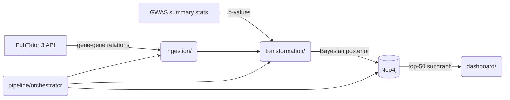

# Living Polygenic Causal Graph (LPGC)

[](LICENSE)

An automated ETL pipeline and interactive visualization tool that extracts gene–gene relationships from new literature, updates a protein–protein interaction network with Bayesian probability weighting, and surfaces emerging hub genes for polygenic traits



## Tech stack

| Layer | Libs |
|---|---|
| Ingestion | Python · Requests · PubTator 3.0 API |
| Transformation | Pandas · SciPy · NetworkX |
| Graph database | Neo4j 4.4+ · Py2neo |
| Dashboard | Dash · Dash Cytoscape |

---

## Prerequisites

- Python 3.11+
- A running Neo4j instance ([Desktop](https://neo4j.com/download/), [Docker](https://hub.docker.com/_/neo4j), or [AuraDB free tier](https://neo4j.com/cloud/platform/aura-graph-database/))

---

## Quick start

```bash
# 1. Clone and enter the project
git clone https://github.com/eganeganegan/Living-Polygenic-Causal-Graph.git && cd Living-Polygenic-Causal-Graph

# 2. Create and activate a virtual environment
python3 -m venv .venv && source .venv/bin/activate

# 3. Install dependencies
pip3 install -r requirements.txt

# 4. Configure credentials
cp .env.example .env
# Edit .env, at minimum set NEO4J_PASSWORD

# 5. Run one ETL cycle
python3 -m pipeline.orchestrator

# 6. Launch the dashboard
python3 -m dashboard.app
# Open http://127.0.0.1:8050
```

---

## Configuration

All settings are read from environment variables. Copy `.env.example` to `.env` and fill in your values it is loaded automatically at startup and is gitignored

| Variable | Required | Default | Description |
|---|---|---|---|
| `NEO4J_URI` | No | `bolt://localhost:7687` | Neo4j Bolt URI |
| `NEO4J_USER` | No | `neo4j` | Neo4j username |
| `NEO4J_PASSWORD` | **Yes** | None | Neo4j password (set to `""` if none) |
| `NCBI_API_KEY` | No | `""` | NCBI API key, raises PubTator rate limit from 3 → 10 req/s |
| `LPGC_DISEASES` | No | `Schizophrenia` | Comma-separated disease queries |
| `LPGC_LOOKBACK_HOURS` | No | `24` | Rolling fetch window in hours |
| `DASH_HOST` | No | `127.0.0.1` | Dashboard bind address |
| `DASH_PORT` | No | `8050` | Dashboard port |
| `DASH_DEBUG` | No | `true` | Dash debug mode |

> **Security note:** The dashboard has no built-in authentication. Keep `DASH_HOST=127.0.0.1` (default) or place it behind a reverse proxy with auth if exposing externally

---

## GWAS data (optional)

Drop GWAS summary stat files into `data/gwas/`. The pipeline auto-discovers files by disease name slug (e.g. `schizophrenia.tsv`)

Two formats are supported:

| Format | Required columns |
|---|---|
| Simple | `gene_id` (NCBI Entrez ID), `p_value` |
| GWAS Catalog | `MAPPED_GENE`, `P-VALUE` |

Genes with a minimum p-value below 5 × 10⁻⁸ receive a boosted Bayesian likelihood in the edge weight update

---

## Running the pipeline manually

```bash
# Default diseases from LPGC_DISEASES env var
python3 -m pipeline.orchestrator

# Override at the command line
python3 -m pipeline.orchestrator \
    --diseases "Schizophrenia,Bipolar Disorder" \
    --lookback 48 \
    --gwas-dir data/gwas
```

diseases are fetched incrementally, the last-run timestamp is stored in `data/raw/pipeline_state.json` so re-runs dont create duplicate edges

---

## Project structure

```
LPGC/
├── ingestion/
│   ├── pubtator_client.py   # PubTator 3 API wrapper with rate-limit backoff
│   ├── fetch_articles.py    # Incremental fetch + disease_tag stamping
│   └── parsers.py           # BioC JSON → gene-gene interaction dicts
├── transformation/
│   ├── bayesian_updater.py  # Bayesian edge weight update + GWAS boost
│   ├── gwas_integrator.py   # GWAS summary stat loader
│   └── scoring.py           # NetworkX hub gene centrality scoring
├── graph/
│   ├── schema.py            # Neo4j constraint + index initialisation
│   ├── neo4j_client.py      # Cached py2neo connection
│   └── queries.py           # Cypher CRUD + subgraph fetch
├── dashboard/
│   ├── app.py               # Dash entry point
│   ├── layout.py            # Component layout
│   ├── callbacks.py         # Neo4j → Cytoscape element builder
│   └── cytoscape_styles.py  # Visual style map
├── pipeline/
│   └── orchestrator.py      # End-to-end ETL runner + CLI
├── data/
│   ├── raw/                 # Cached API responses & pipeline state (gitignored)
│   ├── processed/           # Intermediate outputs (gitignored)
│   └── gwas/                # GWAS summary stat files (gitignored)
├── tests/                   # pytest test suite (27 tests)
├── .env.example             # Environment variable template
├── config.py                # Centralised configuration
└── requirements.txt
```

---

## Running tests

```bash
python3 -m pytest tests/ -v
```

No Neo4j instance is required, graph module tests use a stub

---

## Contributing

1. Fork the repo and create a feature branch
2. Run `pytest tests/`, make sure all of them pass obvs
3. Open a pull request with a clear description of the change

Please do not commit `.env` files or GWAS data files.
